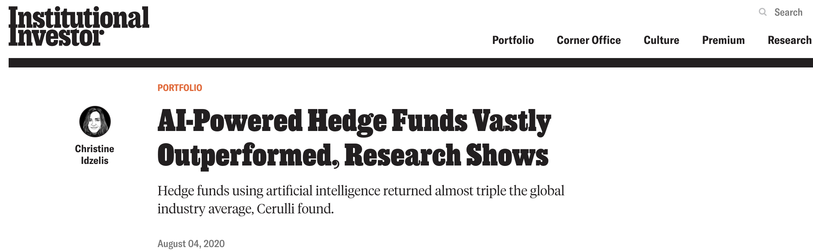
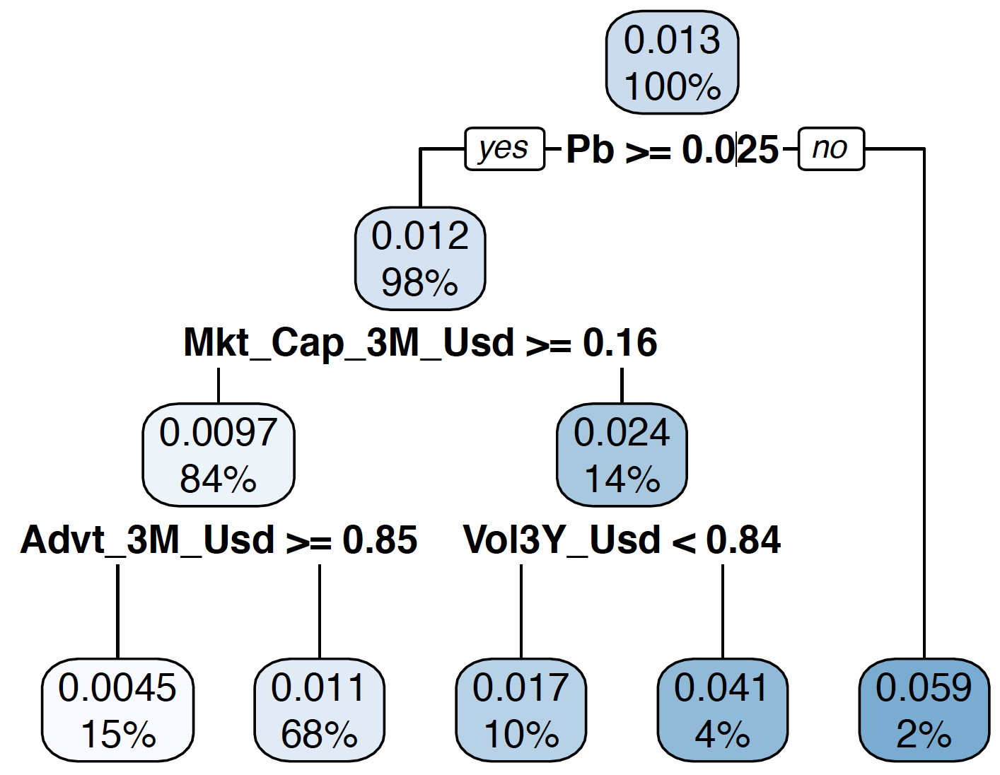
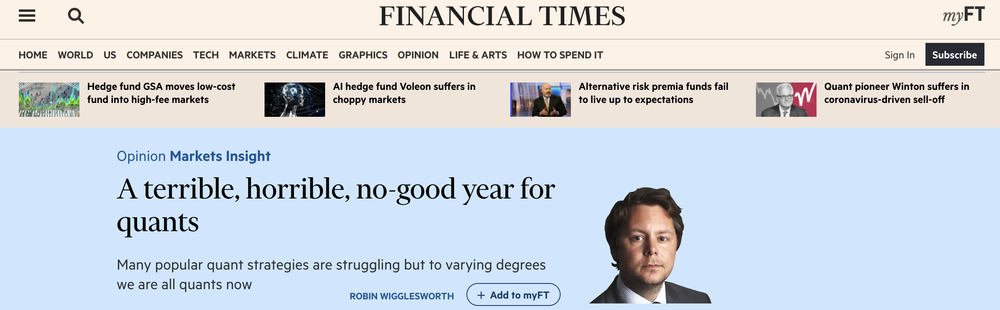
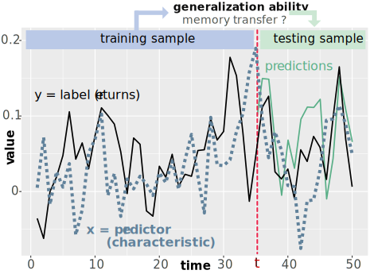
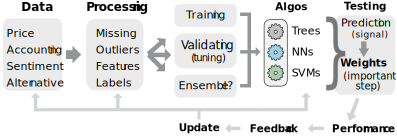
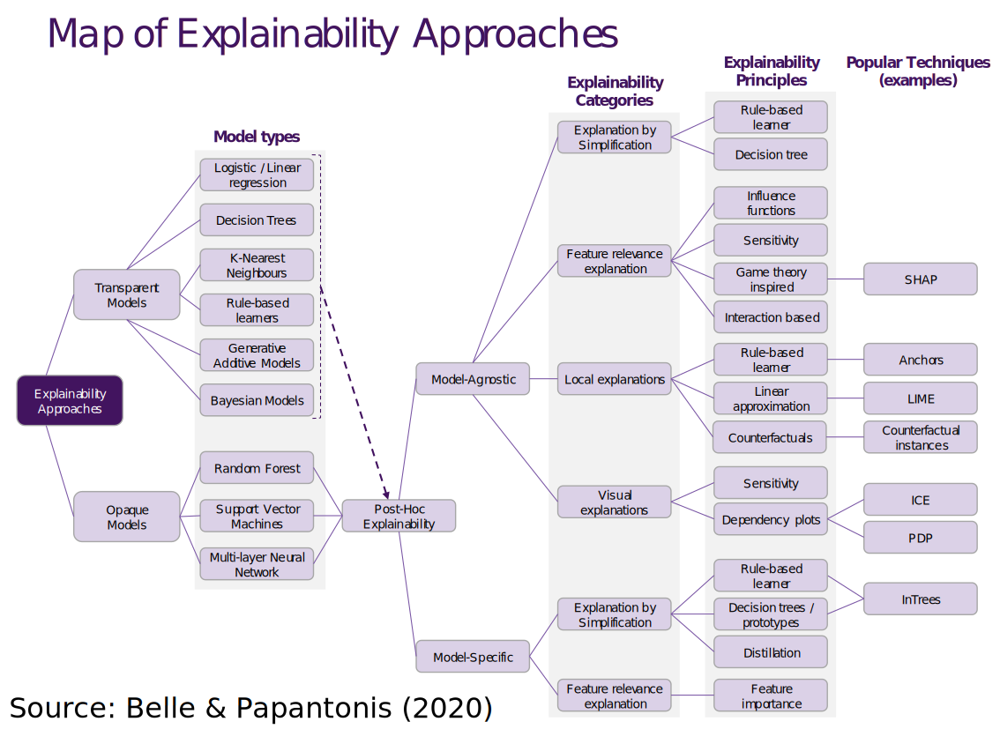
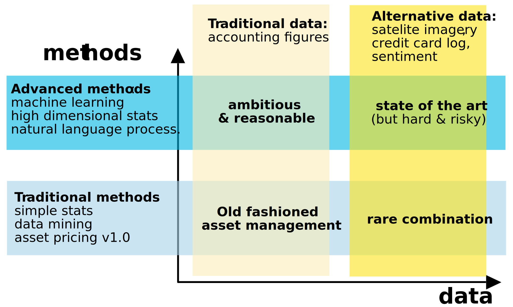

<!-- xaringan::inf_mr() -->

```{r, warning = F, message = F, echo = F}
library(tidyverse)
library(lubridate)
load("data_ml.RData")
```


class: inverse, center, middle, animated, fadeInRight


<style type="text/css">
.remark-slide-content {
font-size: 32px;
padding: 1em 4em 1em 4em;
}
</style>


# Introduction

---
# Overview of AI use-cases in finance


- **task automation** (ex: reading/summarizing, or writing reports)    
- **customer relationship managment** (ex: chatbots, churn minimization for banks and insurance companies)   
- **fraud detection** (ex: credit card hacking)    
- **credit scoring** (for firms & individuals)    
- **asset allocation** (return prediction, risk management... ) $\hspace{25mm}$   $\uparrow$ **.bluen[this is the topic of these slides]**

- ...option pricing?

---
# Machine Learning (ML) for trading: why?
<div style="width: 100%;float: bottom;margin-top:-20px;margin-bottom: 50px;"> 
.font100[
1. Because .bluen[**we can**] (computer power, data availability, software democratization (open source!), and academic maturity).
<div style="width: 100%;float: bottom;margin-top:15px;margin-bottom: 30px;"> 
```{r, message=FALSE, warning=FALSE, echo=FALSE, out.width="450px", fig.align='center'}

```
2. Because it's **fancy** (it makes great marketing pitches because people like .bluen[seeming sophistication]). 
<div style="width: 100%;float: bottom;margin-top:15px;margin-bottom: 30px;"> 
```{r, message=FALSE, warning=FALSE, echo=FALSE, out.width="500px", fig.align='center'}

```
3. Because it **works** (well... it depends - more on that soon).
]
 

---
# What is AI / ML?

- AI refers to tools (algos, robots) which are aimed at **mimicking human cognitive functions** .font90[(and, subsequently, motor functions)].
- One obvious application of AI is **task automation**.   
- Nowadays, building intelligent systems requires **huge amounts of data** (which sometimes can be simulated).   
- ML (a subfield of AI) is intended to "make sense" (i.e., **detect patterns**) of these big datasets (akin to data mining)    
- If these patterns are .bluen[*genuine*], they can be incredibly valuable (more on that soon).

$\rightarrow$ in practice, ML is very efficient for **marketers**.

---
# ML for trading: a tale of frequencies

.font90[The type of ML algo & data used depends on the .bluen[rebalancing rythm]:]  
- **high-frequency**: intraday trades (mins $\rightarrow$ ms). The volume of data comes from **chronology** and the aim is to unveil recent patterns in the **microstructure** process (order book). Usually, the focus is on a limited number of assets (ex: futures, indices, forex) and a limited number of indicators (prices).   
- **low frequency**: monthly/quarterly/annual rebalancing. The volume comes from **cross-sections**: width of assets (hundreds/thousands of stocks, bond issuers), and width of attributes (hundreds).


---
# Low frequency trading with factor investing

In **financial economics**, one central topic is to explain the profitability of firms, that is, why do different firms experience different returns.  

The key word is *different*: in what ways are companies different? $\rightarrow$ we need to **characterize** them. To do so, we resort to .bluen[attributes]:  
* **size** (market cap), 
* **value** (accounting ratios), 
* **momentum** (past perf), 
* **risk** (volatility),  
* etc. 

---
# Data procurement: an enormous offer
<div style="width: 100%;float: bottom;margin-top:-15px;margin-bottom: 30px;"> 

```{r, message=FALSE, warning=FALSE, echo=FALSE, out.width="990px", fig.align='center'}

```

<div style="width: 100%;float: bottom;margin-top:-15px;margin-bottom: 30px;"> 


See also: https://alternativedata.org/data-providers/

---

class: inverse, center, middle, animated, fadeInRight


<style type="text/css">
.remark-slide-content {
font-size: 32px;
padding: 1em 4em 1em 4em;
}
</style>


# Characteristics-based models: a primer


---
class: animated, fadeInRight


# The equation .grey[.font60[( just one, but it's important to understand it)]]
<div style="width: 100%;float: bottom;margin-top:-15px;margin-bottom: 30px;"> 

.bib[
Here it goes*:
$$r_i= f(\textbf{x}_i) + e_i,$$

- $r_i$ is the (future) return of firm $i$ - or any other proxy for **performance**   
- $f$ is some possibly complex function,   
- $\textbf{x}_i$ are the .bluen[firms characteristics] (market cap, earning/debt ratios, past returns, etc.),   
- $e_i$ is the error made by the model ( $f(\textbf{x}_i)$ )

.font90[**Note**: it a **panel** model:] $f$ is the same for all stocks .font60[(the model learns from the cross-section.)]
<div style="width: 100%;float: bottom;margin-top:15px;margin-bottom: 30px;"> 

*.grey[.font80[It's the simple version: it can (should?) be made time-dependent. ]]
]

---
# A simple example

<div style="width: 100%;float: bottom;margin-top:-15px;margin-bottom: 30px;"> 

Assume

$$r_i = a + b*\text{Size}_i + e_i,$$
where Size is a **proxy** of the size of the company (e.g. market capitalization - rescaled/normalized/standardized).   
If $b>0$: large firms earn higher returns (according to the model).   
$\rightarrow$ Usually, it is considered that, **on the long run**, $b<0$: small firms have more potential for **growth**, and thus experience enhanced performance (more on that soon).   
This is related to the so-called **size premium** (or anomaly).   
<div style="width: 100%;float: bottom;margin-top:15px;margin-bottom: 30px;"> 

.font80[.grey[Remember, there are many anomalies: value, momentum, low risk (?), profitability, ..]]


---
# Generalizations

**Extensions** include:         
- adding more characteristics (accounting ratios, risk, sentiment, .bluen[ESG scores], etc.);      
- going beyond linear forms (that where the ML kicks in);    
- Enforcing **conditionality** (ex: via macro-economic indicators).

**BUT**! You should always be wary about the error terms $e_i$! Gaussian? Independent (in time, in the cross-section)?   
Maybe not...

---
# Illustrating nonlinearity with many features

A simple decision tree.

```{r, message=FALSE, warning=FALSE, echo=FALSE, out.width="600px", fig.align='center'}

```


---

class: inverse, center, middle, animated, fadeInRight


<style type="text/css">
.remark-slide-content {
font-size: 32px;
padding: 1em 4em 1em 4em;
}
</style>


# Factor models: limitations


---
# .font90[Factor & Quant investing] $\neq$ .font90[guaranteed success]

```{r, message=FALSE, warning=FALSE, echo=FALSE, out.width="690px", fig.align='center'}



```


---
# First issue: noise! (1/2)

Optimal case: low noise (stylized graph).

```{r, warning = F, message = F, echo = F, fig.align='center', fig.width = 11, fig.height = 6.5 }
library(tidyverse)
library(ggthemes)
set.seed(42)
n_points <- 10^3
x <- runif(n_points)
y <- -x/3 + rnorm(n_points, mean = 0, sd = 0.1) + 0.1
bind_cols(x,y) %>% ggplot(aes(x = x, y = y)) + geom_point() + geom_smooth(se = F) +
  theme_economist() +
    theme(text = element_text(size=24), aspect.ratio = 0.6) + 
    xlab("Size") + ylab("Future return") +
    annotate("text", x = 0.25, y = 0.33, label = "Small firms, high returns", color = "#25C845", size = 6) +
    annotate("text", x = 0.75, y = -0.44, label = "Large firms, low returns", color = "#FE210B", size = 6) 

```


---
# First issue: noise! (2/2)

Second configuration: overwhelming noise (more realistic).

```{r, warning = F, message = F, echo = F, fig.align='center', fig.width = 10, fig.height = 5.5 }
set.seed(42)
n_points <- 10^3
x <- runif(n_points)
y <- -x/20 + rnorm(n_points, mean = 0, sd = 0.1) + 0.1
bind_cols(x,y) %>% ggplot(aes(x = x, y = y)) + geom_point() + geom_smooth(se = F) +
  theme_economist() +
    theme(text = element_text(size=24), aspect.ratio = 0.6) + xlab("Size") + ylab("Future return") +
    annotate("text", x = 0.15, y = 0.33, label = "Small firms, high returns?", color = "#25C845", size = 6) +
    annotate("text", x = 0.85, y = -0.33, label = "Large firms, low returns?", color = "#FE210B", size = 6) 
  
```

.font70[In practice, things are much more complicated (many predictors, nonlinearities, etc.)]


---
# Second issue: changing environments (1/4)
.font90[Average returns, volatility, factor loadings, they all] **change**! .font80[(No arbitrage..)]

```{r, warning = F, message = F, echo = F, fig.align='center', fig.width = 9, fig.height = 6.5}
set.seed(42)
n_points <- 10^3
x <- runif(n_points)
y1 <- -x/20 + rnorm(n_points, mean = 0, sd = 0.1) + 0.1
y2 <- x/30 + rnorm(n_points, mean = 0, sd = 0.1) + 0.1
d1 <- bind_cols(x = x, y = y1, year = 2025)
d2 <- bind_cols(x = x, y = y2, year = 2026)
bind_rows(d1, d2) %>% 
    ggplot(aes(x = x, y = y, color = as.factor(year))) + geom_point() +
  theme_economist() +
    scale_color_manual(values = c("#FE7714", "#1462FE")) + geom_smooth() +
    theme(text = element_text(size=24)) + 
    xlab("Size") + ylab("Future return") +
    labs(color = "Hypothetical Year")
```


---
# Second issue: changing environments (2/4)

**value** minus **growth** (long-short) portfolios:

```{r, message = F, warning = F, echo = F, fig.align='center', fig.width = 10, fig.height = 6.5}
data_ml %>%
  mutate(year = year(date)) %>%
  group_by(date) %>%
  mutate(value = Pb < median(Pb)) %>%
  group_by(year, value) %>%
  summarise(ret = mean(R1M_Usd)) %>% 
  pivot_wider(names_from = "value", values_from = "ret") %>%
  mutate(ret_ls = 12*( `FALSE`-`TRUE`)) %>%
  ggplot(aes(x = year, y = ret_ls)) + geom_col() +
  theme_wsj() +
  theme(text=element_text(size=26))
```

---
# Second issue: changing environments (3/4)
<div style="width: 100%;float: bottom;margin-top:-20px;margin-bottom: 30px;"> 
```{r, message=FALSE, warning=FALSE, echo=FALSE, out.width="770px", fig.align='center'}

```


---
# Second issue: changing environments (4/4)


Any **solutions**?

- first, make sure your models evolve & react to **new data**! One natural inclination is to fix the model once & for all... that's a bad idea. **Updating** is key (though the details are far from obvious).  
- second, think broadly. Does the **macroeconomy** help explain some variations? Stocks do not move out of nowhere... The .bluen[credit spread] may matter for the **Size** factor. There are many ways to integrate macro indicators in predictive models.


---
# Third isse: algorithmic overfitting (1/2)
<div style="width: 100%;float: bottom;margin-top:-25px;margin-bottom: 30px;"> 
**Sophisticated** models $\neq$ better. (exaggerated version below)

<div style="width: 100%;float: bottom;margin-top:25px;margin-bottom: 30px;"> 
```{r, warning = F, message = F, echo = F, fig.align='center', fig.width = 11, fig.height = 6.5 }
set.seed(42)
n_points <- 150
x <- runif(n_points)
y <- -x/20 + rnorm(n_points, mean = 0, sd = 0.1) + 0.1
z <- bind_cols(x = x, y = y) 
z0 <- data.frame(x = rep(0.5, 10), y = rep(0.8, 10))
z00 <- data.frame(x = rep(0.52, 15), y = rep(0.78, 15))
z1 <- bind_rows(z, z0, z00)
z1 %>% ggplot(aes(x = x, y = y)) + geom_point() + geom_smooth(se = F, color = "red") +
  theme_economist() +
    theme(text = element_text(size=24), aspect.ratio = 0.6, legend.position = c(0.5, 0.15)) +
    xlab("Size") + ylab("Future return") +
    geom_smooth(data = z, se = F) +
    annotate("rect", xmin = 0.48, xmax = 0.54, ymin = 0.7, ymax = 0.9, alpha = .25, color = "black", fill = "black") +
    annotate("text", x = 0.60, y = 0.8, label = "Outliers", color = "black", size = 6) +
    annotate("segment", x = 0.5, xend = 0.5, y = 0.08, yend = 0.38, colour = "#656666", size = 1.5, arrow=arrow()) +
    annotate("text", x = 0.48, y = 0.43, label = "A few points push the complex model in a potentially wrong direction", color = "black", size = 6)


```

---
# Third isse: algorithmic overfitting (2/2)

Some **solutions** to overfitting:   
- often, they are technical and algorithm-dependent. Penalization for regressions, trees and neural networks takes various forms. This requires a bit of **practice**.
- one heuristic tip is (surprisingly): .bluen[in doubt, avoid complex models]!   
- if you like sophistication, invest time in robustness checks & sensitivity analysis (HP, time windows)


---
# Fourth issue: backtest overfitting (1/4)

Quant/Systematic models should be **dynamic** - even in backtests!
<div style="width: 100%;float: bottom;margin-top:25px;margin-bottom: 30px;"> 


```{r, message=FALSE, warning=FALSE, echo=FALSE, out.width="990px", fig.align='center'}

```

---
# Fourth issue: backtest overfitting (2/4)

.font90[Imagine a **quant fund manager** with 5 modelling engines] (.font80[Random Forests, Boosted Trees, Simple Neural Nets, Recurrent NN, Ensemble]).   
.font90[Say, she wishes to test 10 HP values for each family of models (that's a pretty small number to evaluate sensitivity).  
This makes 50 combinations. Then, assume there are 4 ways to translate predictive signals into portfolio weights (equal weights of best forecasts, minimum variance, maximum Sharpe ratio, equal risk contribution).]  
$\rightarrow$ In the end, this makes **200 options to build a strategy**. 


.font90[.grey[And I haven't even mentioned data pre-processing.]] `r emo::ji("wink")`

---
# Fourth issue backtest overfitting (3/4)

.font90[So the fund manager is going to **backtest** these strategies, that is, test them on data. Sadly, she only has past data at her disposal... And in the end, she is going to pick the one that works best (after robustness checks, sensitivity analyses, etc.)]

Is this choice truly the best? Will it work well in live trading (out-of-sample)? Probably not, because the strategy is optimized on only one dataset! .font70[.grey[In factor investing, artificial data is hard to generate.]]

A rule of thumb: take the **Sharpe ratio** of the best strat and .bluen[divide it by two] to get a better estimate of what will happen.

---
# Fourth issue: backtest overfitting (4/4)

This relates to a crisis of .bluen[reproducibility]:

- Academic research is plagued by the "*publish or perish*" paradigm (with a strong bias towards positive results).    
- Likewise, money managers are pressured to craft **winning strategies**, but can only backtest on past data + lottery strats.

$\rightarrow$ we are pushed towards **false positives**. We so badly want to find recipes that succeed, that we end up forgetting the framework in which we work. Often, the best strategies perform well by chance! (one lucky random trajectory of the world)

---
# Fifth issue: trust
<div style="width: 100%;float: bottom;margin-top:-25px;margin-bottom: 30px;"> 
Can I understand a complex model?
<div style="width: 100%;float: bottom;margin-top:5px;margin-bottom: 30px;"> 
```{r, message=FALSE, warning=FALSE, echo=FALSE, out.width="710px", fig.align='center'}

```

---

class: inverse, center, middle, animated, fadeInRight


<style type="text/css">
.remark-slide-content {
font-size: 32px;
padding: 1em 4em 1em 4em;
}
</style>


# Final words


---
# Going further: the book!

It is located at http://www.mlfactor.com.    
The **material** can be accessed at https://github.com/shokru/mlfactor.github.io/tree/master/material    
It includes a reasonably sized dataset & all the R codes (Python soon to come). .bluen[Nothing will replace **practice**]!    

If you want a review of recent advances in ML & econometrics in financial economics, have a look at my html [presentation](https://www.gcoqueret.com/files/AAP/AAP.html)

---
# Wrap up: key takeaways

Factor investing aims to explain or predict financial returns with .bluen[firms characteristics]. 

People tend to focus on sophistication, which sometimes does add value, but requires a huge amount of expertise. Often it is preferable to spend more time on **simple approaches** & have an integrated understanding of the models. 

One major topic I left out is **causality**. It's incredibly important in ML, but personally, I think it's still out of reach in factor investing.  


---
# Where to go from now
<!-- # Going forward & recommendations --> 
Determine a position on the **quadrant**:

```{r, message=FALSE, warning=FALSE, echo=FALSE, out.width="790px", fig.align='center'}

```


---
# Where to spend money?

.font110[
- **software** & **IT** (hardware) are relatively **cheap**.   
- **data** *can* be **costly**.
- .bluen[**human capital**] is **key**. Good quants are expensive, but more *likely* to deliver. Bad quants are cheaper... but may end up underperforming. 
]

$\rightarrow$ **Time**, because it is scarce, is the most important resource.   
**Understanding** the limits & weaknesses of models & backtests matters **A LOT**!


---

<center>
.large[THANK YOU!]
<br>
<br>
<br>
.bluen[**What are your questions? **]
</center>


